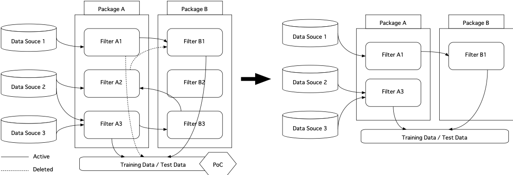

# Discard PoC Code (PoCのコードは破棄する)

## 概要

PoCのために作成したコードは破棄し、PoCで得た知見に基づき保守性の高いコードを再構築する
一般的に、PoCのために作成したコードでは、試行錯誤を効率的に実施するための保守性を犠牲にしたコードや、最終的には不要なったコードが含まれることが多い。
このPoCのために作成したコードを、プロダクトコードに組み込むと、プロダクトの品質を低下させてしまうため、PoCで検証した事実に基づき、全体的に再設計したものを、プロダクトコードに組み込む

## Intent

機械学習に関連するプロダクトコードから不要なコードや、非効率なコード、可読性の低いコードを除外する

## Problem
 
アンチパターン「Glue Code」「Pipeline Jungle」が発生しており、MLSの機械学習部分の保守性が低く、機械学習部分の修正コストが非常に大きい

## Solution

プロダクトコードに組み込む際に、機械学習モデル関連のコードを全体的に再設計する

## Context

- フェーズ：PoCの検証後
- MLアプリケーションの利用環境：一般

## Discussion

- 新しいデータの追加などにより、機械学習モデル部分も継続的に保守を実施する必要がある
- 目的とする機械学習モデルの構築のために、多くのデータ、多くの手法を試行錯誤を行なった場合に行う
